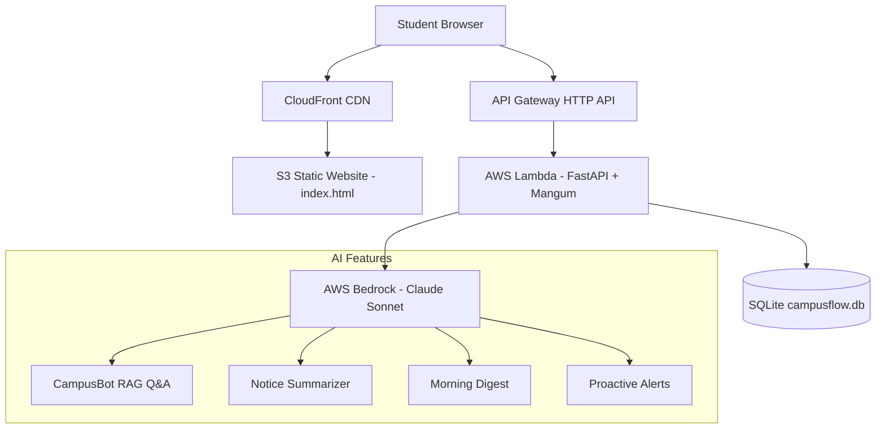

# 🎓 CampusFlow — AI Operating System for College Life

> Built for **Amazon HackOn Season 6.0** | AWS Track

**CampusFlow** is a unified AI assistant that eliminates the chaos of student life — classes, deadlines, hostel notices, placement prep, attendance, and expenses — all in one intelligent interface.

The student never searches for anything. CampusFlow anticipates needs and acts proactively.

---

## 🚀 The Problem

Student life is scattered across WhatsApp groups, emails, portals, and spreadsheets. Important updates are constantly missed. CampusFlow is ONE unified AI assistant that fixes all of this.

---

## ✨ Features

| # | Feature | Description |
|---|---------|-------------|
| 1 | **Routine Understanding** | Personalized morning digest, exam countdown, smart daily briefing |
| 2 | **Update Summarization** | AI-powered 2-line notice summaries with urgency tagging |
| 3 | **Smart Scheduling** | Visual Mon-Sat timetable, clash detection, free slot finder |
| 4 | **CampusBot (RAG Q&A)** | "Can I skip CN today?" → checks attendance, gives smart answer |
| 5 | **Proactive Alerts** | Warns BEFORE problems happen — attendance drops, deadlines, budget |
| 6 | **Personal Life Management** | Budget tracker, mood check-in, burnout detection, placement board |

---

## 🏗️ Tech Stack

| Layer | Technology |
|-------|-----------|
| Frontend | Single-file HTML + CSS + Vanilla JS (dark theme, mobile responsive) |
| Backend | Python FastAPI (single main.py) |
| Database | SQLite (prototype) / DynamoDB (production) |
| AI | AWS Bedrock (Claude Sonnet) with rule-based fallback |
| Infra | AWS Lambda + API Gateway + S3 + CloudFront |

---

## 📐 AWS Architecture



---

## 📁 Project Structure

```
campusflow/
├── frontend/
│   └── index.html              # Complete single-file app (8 screens)
├── backend/
│   ├── main.py                 # FastAPI — all endpoints + Bedrock integration
│   ├── database.py             # SQLite setup + sample data
│   ├── requirements.txt
│   ├── .env.example            # AWS credentials template
│   └── .env                    # (gitignored) Actual credentials
└── infrastructure/
    ├── aws_setup.sh            # Full AWS deployment script
    ├── dynamodb_schemas.json   # DynamoDB table definitions
    ├── iam_policy.json         # Lambda execution role
    ├── mangum_handler.py       # Lambda handler wrapper
    └── architecture.mermaid    # Architecture diagram
```

---

## ⚡ Quick Start (Local)

### Prerequisites
- Python 3.9+
- AWS credentials with Bedrock access (optional — app works without them)

### Setup

```bash
# 1. Clone the repo
git clone <repo-url>
cd campusflow

# 2. Install dependencies
cd backend
pip install -r requirements.txt

# 3. Configure AWS credentials (optional)
cp .env.example .env
# Edit .env with your AWS credentials

# 4. Initialize database with sample data
python database.py

# 5. Run the server
python main.py
```

### Open the app
```
http://localhost:8000
```

### Demo Login
- **Name:** Arjun Sharma
- **Password:** demo123

---

## 🧪 Demo Flow

1. Open http://localhost:8000 → Login screen
2. Click **"Demo Login"** → Auto-fills Arjun Sharma / demo123
3. **Dashboard** → Morning digest, stat cards, today's schedule, proactive alerts
4. **CampusBot** → Type "Can I skip CN today?" → Smart attendance-aware answer
5. **Notices** → 6 cards with AI-generated 2-line summaries + urgency tags
6. **Schedule** → Weekly Mon-Sat grid, color-coded by type
7. **Attendance** → CN in red (68%), OS in amber (78%), can-I-skip calculator
8. **Personal Life** → Budget bar (₹3800/₹5000), mood check-in, placement board

---

## ☁️ AWS Deployment

```bash
cd infrastructure
chmod +x aws_setup.sh
./aws_setup.sh
```

This script creates:
- S3 bucket with static website hosting (frontend)
- Lambda function with FastAPI + Mangum
- API Gateway HTTP API
- DynamoDB tables (11 tables)
- IAM role with Bedrock + DynamoDB permissions
- CloudFront distribution

---

## 🤖 AI Integration (AWS Bedrock)

CampusFlow uses AWS Bedrock Claude Sonnet for:

| Feature | Prompt Strategy |
|---------|----------------|
| CampusBot | RAG with student data context + 30-entry campus FAQ |
| Notice Summary | "Summarize in exactly 2 lines: action + deadline" |
| Morning Digest | "80 words: urgent task + warning + motivation" |
| Proactive Nudges | "3 alerts, under 20 words each, urgent-feeling" |

**Graceful fallback:** All features work without Bedrock using rule-based logic.

---

## 📊 API Endpoints

| Method | Endpoint | Description |
|--------|----------|-------------|
| POST | `/api/auth/login` | User authentication |
| POST | `/api/auth/register` | New user registration |
| GET | `/api/dashboard` | Morning digest + stats |
| POST | `/api/chat` | CampusBot AI chat |
| GET | `/api/notices` | Summarized notices |
| GET | `/api/schedule` | Weekly timetable |
| GET | `/api/attendance` | Attendance with can-skip |
| GET | `/api/exams` | Exam countdown |
| GET | `/api/nudges` | Proactive alerts |
| GET | `/api/personal/overview` | Budget + wellness + placements |
| POST | `/api/personal/expense` | Add expense |
| POST | `/api/personal/mood` | Mood check-in |

---

## 👨‍💻 Team

Built for **Amazon HackOn Season 6.0** — AWS Track

---

## 📄 License

MIT
